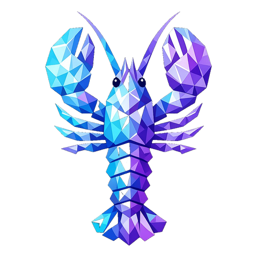

<p align="center">
  
</p>

<h1 align="center">Crystal</h1>

<p align="center">
  <strong>The most complete desktop frontend for <a href="https://github.com/nichochar/open-claw">OpenClaw</a>.</strong><br/>
  A native AI command center with 30 views, AI-powered search, 70+ slash commands, NVIDIA-accelerated voice, 8-provider LLM support with offline mode, dual-layer memory (MemPalace + LanceDB Pro), 1Password secret management, token cost analytics, a unified voice gateway, and a full agent workspace — all in a single desktop app.
</p>

<p align="center">
  <a href="#-features"></a>
  <a href="#-ai-chat"></a>
  <a href="#-voice-engine"></a>
  <a href="#-multi-provider-llm"></a>
  <a href="#-tech-stack"></a>
  <a href="#-voice-engine"></a>
  <a href="#-themes"></a>
  <a href="LICENSE"></a>
</p>

<p align="center">
  <a href="#-whats-new">What's New</a> · <a href="#-features">Features</a> · <a href="#-quick-start">Quick Start</a> · <a href="#-tech-stack">Tech Stack</a> · <a href="#-contributing">Contributing</a>
</p>

---

## What's New

### April 2026 — Local LLM via vLLM + Docker

Crystal now ships with a fully optimized local LLM inference stack via [vLLM](https://github.com/vllm-project/vllm) and Docker — no cloud API needed.

**Model:** `nvidia/Qwen3-30B-A3B-NVFP4` (30B total / 3B active MoE, NVFP4 quantized)

| Benchmark | Result |
|-----------|--------|
| Peak generation | **237 tok/s** (RTX 5090 reference) |
| Sustained generation | **196–235 tok/s** (varies by GPU) |
| Tool call (auto) | **~150 ms** |
| Tool call (required) | **728 ms** |
| Multi-tool (2 tools) | **638 ms** |
| VRAM usage | ~17 GB of 32 GB |
| KV cache | 259K tokens (FP8) |

**Speed optimizations applied:**

- **Marlin GEMM backend** (`VLLM_NVFP4_GEMM_BACKEND=marlin`) — Marlin kernels for NVFP4 weight decompression, significantly faster than default FlashInfer CUTLASS
- **Marlin MoE** (`VLLM_USE_FLASHINFER_MOE_FP4=0`) — Routes MoE FP4 operations through Marlin instead of FlashInfer
- **FP8 KV cache** (`--kv-cache-dtype fp8`) — Halves KV cache memory, doubles context capacity
- **CUDA graphs** (`--performance-mode interactivity`) — Fine-grained CUDA graphs optimized for low single-request latency
- **Prefix caching** (`--enable-prefix-caching`) — Caches repeated system prompts for instant reuse
- **Chunked prefill** (`--max-num-batched-tokens 4096`) — Caps prefill batch size for lower latency
- **Memory profiler** (`VLLM_MEMORY_PROFILER_ESTIMATE_CUDAGRAPHS=1`) — Accurate CUDA graph memory accounting for maximum KV cache allocation
- **Expandable segments** (`PYTORCH_CUDA_ALLOC_CONF=expandable_segments:True`) — Reduces CUDA memory fragmentation
- **Hermes tool parser** — Reliable tool call extraction for function calling workflows
- **Barubary attuned chat template** — Community-fixed Jinja template with 21 bug fixes over the official Qwen3 template (tool call bleed, parallel tools, streaming compat, thinking/tools conflict)

**Quick start:**

```bash
# Set your HuggingFace token (for gated model access)
echo "HF_TOKEN=hf_your_token_here" > .env

# Start vLLM (first run downloads ~15 GB model)
docker compose up -d

# Check status
.\scripts\vllm-docker.ps1 status
```

The server is OpenAI-compatible at `http://localhost:8000`. Crystal auto-detects it on startup.

---

### April 2026 — v0.8.0 Chat Settings, GPU HUD, Voice Gateway, Forge Pipeline

#### World-Class Chat Experience
- **In-Chat Settings Drawer** — Gear icon in the chat header opens a 300px slide-out panel with model selector, temperature/max tokens/top-p sliders, thinking level picker, response style presets (Concise/Balanced/Detailed), and streaming toggle. All settings persisted to localStorage via new `chatSettingsStore`.
- **Offline Mode Toggle** — One-click switch to local models. Auto-detects vLLM on port 8000 and Ollama on port 11434, stores/restores cloud model on toggle. Green "LOCAL" badge in header when active.
- **Regenerate Response** — RefreshCw button on the latest assistant message to re-run the prompt with current settings.
- **Edit & Resend** — Pencil icon on user messages opens inline edit mode. Truncates history at that point and resends with the edited content.
- **Message Feedback** — ThumbsUp/ThumbsDown on every assistant message, persisted in conversation data. Filled icon when selected.
- **Conversation Export** — Download icon + `Ctrl+Shift+E` exports the full conversation as a formatted Markdown file with metadata header.
- **In-Chat Search** — Search icon + `Ctrl+F` opens a search bar that filters messages and highlights matches with an amber border glow.
- **Keyboard Shortcuts** — `Ctrl+Shift+N` (new chat), `Ctrl+F` (search), `Ctrl+Shift+E` (export), `Escape` (close settings/search).
- **Parameters Wired to Pipeline** — Temperature, max tokens, and top-p are now written to `agents.defaults` in `openclaw.json` via `applySessionOverrides()` before each chat, with deduplication to avoid redundant config writes.
- **Message Count** — Live message count shown in header.

#### GPU Monitor HUD Redesign
- **HUD-Inspired Design** — Complete rewrite of `GpuMonitor.tsx` with cyberpunk HUD styling: corner brackets, scan-line overlay, decorative tick marks on ring gauges.
- **Large GPU Core Ring** — 100px ring gauge with 12 cyan tick marks, pulsing center glow above 80% utilization.
- **Secondary Metric Rings** — Three 58px rings for VRAM, Temperature, and Power draw with color-coded thresholds.
- **Segmented Bars** — 20-segment notched progress bars for VRAM and Power replacing smooth gradients. Filled segments glow, empty segments show dim outlines.
- **Stats Grid** — Four-column grid showing Core%, VRAM%, Temp, and Power with glowing monospace values.
- **Utilization History Chart** — Vertical bar chart showing last 20 GPU utilization samples with HUD grid lines and color gradient (green to amber).
- **HUD Section Label** — "01//GPU MONITOR" numbering style with cyan monospace font replaces generic section label in HomeView.

#### Unified Voice Gateway
- **Voice Gateway Service** — New `voice_gateway.py` FastAPI service on port 6500 that unifies STT and TTS backends. Normalizes HTTP (`/stt/transcribe`, `/tts/speak`) and WebSocket (`/stt/realtime`, `/tts/realtime`) endpoints. Routes to NVIDIA Parakeet STT (`nvidia_stt_worker.py`, port 8090) and NVIDIA Magpie TTS (`nvidia_tts_worker.py`, port 8091), with the browser Web Speech API as an emergency fallback when local services are unavailable.
- **vLLM Integration** — vLLM added as the preferred local LLM backend (port 8000). Rust backend prioritizes vLLM over Ollama for auto-start. New provider in Settings, token usage store, and secrets management.
- **STT Worker FastAPI Rewrite** — `nvidia_stt_worker.py` rewritten from aiohttp to FastAPI with `/transcribe`, `/ws`, `/health`, and auto-generated `/docs` endpoints.
- **Voice Pipeline Optimization** — 20ms audio chunking, Web Audio API playback (replacing HTMLAudioElement), parallel provider initialization, warm-mic pause/resume, health check caching (5s TTL), and pre-connection audio buffering.

#### Forge Software Factory Overhaul
- **Automatic 4-Stage Pipeline** — Plan → Code → Test → Review stages with specialized agent prompts. Each stage streams live output via Rust `start_streaming_command`.
- **Tabbed Interface** — Pipeline, Workspace, History, and Deploy tabs replacing the old two-tab layout.
- **Build Model** — New `Build` data structure with pipeline stages, per-stage status/output, and build metadata.

### April 2026 — v0.7.0 Major Feature Release

#### Agent & View Consolidation
- **Agents/Office Merge** — `OfficeView` fully merged into `AgentsView`. The Agents view now includes a live monitoring dashboard with agent cards, session counts, token usage, task dispatch form, and "Send to Chat" buttons. The Office nav entry, route, and file have been removed; all references redirect to Agents.

#### Dashboard Enhancements
- **Vector Store Visualization** — New dashboard card with a segmented ring gauge showing vector chunk count, satellite status dots for Vector DB/FTS/file readiness, and inline status rows (Vector DB, Full-text Search, Provider, Index Pending). Powered by enriched `fetchMemoryStatus` that now fetches `openclaw memory status --json` in parallel.
- **Memory Chunks Ring Gauge** — Memory section upgraded from a standalone dot matrix to a `RingGauge` + `DotMatrix` combo card with click-through to Memory view.
- **Floating Performance Graphs** — System Performance ring gauges (CPU/RAM/Storage) and Lifetime Tokens radial burst now render with fully transparent backgrounds — no card outline or shadow — so they appear to float directly on the page.
- **NVIDIA Logo (Official)** — Replaced the incorrect GPU section logo with the official NVIDIA "eye" SVG from Simple Icons. The `NvidiaLogo` component is now exported from `GpuMonitor.tsx` for reuse.
- **NVIDIA Logo for Local LLM** — The local model card in the LLM Models section now uses the official `NvidiaLogo` with NVIDIA green (`#76b900`) branding instead of the old Ollama logo, reflecting that local inference runs on NVIDIA GPUs.

#### Calendar Redesign
- **Agenda Timeline** — The Command Center Calendar tab completely rebuilt from an overcrowded 24×7 grid to a scalable agenda-style view with:
  - Week navigation (Previous / Today / Next Week)
  - Clickable 7-day picker row with per-day job counts
  - 24-hour activity heatmap with color intensity proportional to job density
  - Stats bar (Total Jobs, Fires Today, Active Hours, Recurring, Daily)
  - Vertical timeline grouped by hour with expandable job cards
  - Frequency breakdown summary
  - "NOW" badge on the current hour

#### Tools & Skills Management
- **Skill Enable/Disable Toggles** — Each skill card in the Tools → Skills tab now has an inline toggle switch. Skills can be enabled/disabled directly from the UI without CLI or config file edits. Disabled skills are visually dimmed with an "OFF" badge.
- **ClawHub Tab** — New "Hub" tab in Tools for discovering and installing verified 3rd-party skills from ClawHub. Includes search, install, update individual skills, update all, and sync. Installed skills displayed in a grid with version badges.
- **OpenShell Sandbox in Tools** — Full sandbox management (install, enable/disable, Docker detection, sandbox listing, logs) duplicated from Settings into the Tools → Sandbox tab for easier access.

#### Token Usage & Cost Estimation
- **Estimated Costs** — Usage page now calculates estimated dollar costs for all providers: cloud APIs (OpenAI, Anthropic, DeepSeek, xAI, Google) use published per-million-token rates; local GPU (Ollama, NVIDIA STT/TTS) uses electricity-based estimates (configurable wattage and $/kWh).
- **Local Compute Savings** — Prominent comparison card showing "If sent to cloud API" vs. "Actual electricity cost" with a savings multiplier badge.
- **$/M Tok Column** — Input/Output token breakdown table now includes a blended cost-per-million-tokens column and GPU badges for local providers.
- **Pricing Methodology** — Detailed footer explaining how cloud and local costs are estimated.

#### Navigation Overhaul
- **Three Collapsible Sections** — Sidebar reorganized into:
  - **MISSION** (top) — Home, City, Chat, Command Center
  - **CLAW** (middle) — Agents, Forge, Memory, Models, Channels, Skills, Hooks, Tools
  - **SYSTEM** (bottom) — Usage, Doctor, Settings
  - All three sections are independently collapsible with chevron toggles.
- **Tools Moved to Claw** — Tools tab relocated from the System section to the Claw section for easier access alongside Skills and Memory.
- **Skills Nav Entry** — New sidebar entry for Skills/Marketplace under the Claw section.

#### AI Search & Command Intelligence
- **System Prompt Rewrite** — The Crystal AI chatbot (Ctrl+K search and slash commands) now has comprehensive knowledge of all 30+ views, including Dashboard sections (ring gauges, vector store, GPU), Command Center tabs, Agents monitoring, Forge capabilities, Memory tiers and vector DB, Tools tabs (Skills/Hub/Sandbox), Usage analytics, and all extended views.
- **Navigation Tips** — AI responses now include actionable tips like "To manage cron jobs: Navigate to Command Center → Scheduled tab".
- **Expanded View Map** — 80+ keyword-to-view mappings (up from ~45), covering aliases like `"forge"`, `"vector store"`, `"clawhub"`, `"sandbox"`, `"api costs"`, `"gpu monitor"`, etc.
- **Slash Commands Sync** — 30+ navigation slash commands added/updated, stale duplicates removed (`/office`, duplicate `/agents`), new commands: `/city`, `/calendar`, `/heartbeat`, `/forge`, `/usage`, `/hub`, `/sandbox`, `/sessions`, `/tasks`, `/approvals`, `/subagents`, `/webhooks`, `/voice`, `/devices`.
- **Command Palette Refresh** — Updated icons (LayoutDashboard for Command Center), added City and Usage as top-level entries, accurate descriptions matching current functionality.

### April 2026 — v0.6.0.1 Dashboard Polish, Audit & Bug Fixes

- **Dashboard Redesign** — Complete visual overhaul with SVG data visualizations: ring gauges (CPU, RAM, Storage), radial burst (lifetime tokens), smooth bezier sparklines (CPU/RAM trends), mini bar charts (cron jobs), dot matrix (memory), and glow progress bars — all theme-aware.
- **Apple-Meets-Futuristic UX** — Every card lifts, scales, and glows on hover with spring-eased micro-interactions. Press-down feedback on clickable elements. Smooth cubic-bezier transitions throughout. Status dots pulse when disconnected.
- **Dual LLM Model Display** — Dashboard LLM card now shows both hosted (OpenAI with official logo) and local (Ollama) models side by side with independent status indicators and live model name from `ollama ps`.
- **GPU Monitor Redesign** — Rebuilt with ring gauge, glow bars, metric chips, NVIDIA-green branding, hover interactions, and theme-aware colors to match the new dashboard aesthetic.
- **Quick Actions Relocated** — Moved from dashboard to Command Center Workflows tab for a cleaner home screen.
- **Voice Button Cleanup** — Removed duplicate voice orb from dashboard (kept in chat).
- **8 Bug Fixes from Full Audit:**
  - CommandPalette: `selectedIndex` could go to -1 on empty lists
  - Onboarding: rejected `Promise.allSettled` branches left prereq rows stuck loading
  - AgentsView: stale closure in `loadAgents` callback
  - DataStore: five unguarded `JSON.parse` calls wrapped in try/catch
  - AppStore: invalid persisted view validated against `VALID_VIEWS` set
  - HomeView: `RingGauge` positioning fix, `RadialBurst` deterministic rendering
  - App.tsx: `FloatingOrb` accessibility — added contextual `aria-label`
- **Version Sync** — `Cargo.toml` and `tauri.conf.json` both aligned to v0.6.0.
- **CSS Animations** — Added `pulse-dot` keyframe for disconnected status indicators.

### April 2026 — v0.6.0 Sandbox, City, Memory & Performance

- **NVIDIA OpenShell Sandbox** — One-toggle sandbox mode in Settings. Agents execute inside isolated [OpenShell](https://github.com/NVIDIA/OpenShell) containers with filesystem, network, and process isolation. Auto-detects Docker, creates sandboxes from the `openclaw` community image, and reverts cleanly if anything fails. Requires Docker Desktop.
- **Crystal City — Future-Punk Visualization** — Full cyberpunk isometric city with neon buildings, holographic billboards, flying drones, electric arcs, rain, steam vents, scanlines, and shooting stars. Agents walk between buildings, display current tasks in speech bubbles, and show status rings. HUD includes activity feed, agent roster, and live clock.
- **Memory System Overhaul** — New Knowledge Base tab for browsing, viewing, and editing all workspace `.md` files (SOUL.md, USER.md, AGENTS.md, etc.). New Tiers tab visualizing HOT → WARM → COLD memory hierarchy. ClawHub memory skills (`memory-never-forget`, `elite-longterm-memory`) installed.
- **Sidebar Consolidation** — Navigation reduced from 31 to 15 items with collapsible OpenClaw section. All views remain accessible via Ctrl+K command palette.
- **Concurrency Limiter** — `cache.ts` now throttles CLI commands to 3 concurrent requests max, preventing WebSocket handshake timeouts and gateway lane stalls.
- **Batched Prefetching** — Data store prefetches in 3 sequential batches with 30s cooldown instead of flooding the gateway with 12+ parallel requests.
- **Reduced Polling** — Gateway reconnection intervals, City polling, and data refresh rates all reduced to minimize gateway load.
- **Factory Builds Tab** — Live Claude Code sub-agent builds with spawn, steer, send, and log streaming.

### April 2026 — v0.5.0 Full OpenClaw Alignment

- **Live Agent Office** — OfficeView rebuilt with real-time agent monitoring. Shows all OpenClaw agents with live sessions, running tasks, token counts, and dispatch functionality — no more fake preset agents.
- **Skill Launcher Factory** — FactoryView rebuilt with a searchable Skills tab showing all 18+ workspace skills (bill-sweep, bounty-hunter, car-broker, etc.) with eligibility status, missing dependency details, and one-click launch. Projects tab preserved for autonomous code builds with any agent ID.
- **Skill-Based Workflows** — 12 real workflows mapped to OpenClaw skills: Bill Sweep, Bounty Scout, Car Deal Finder, Home Service Quote, Market Research, VC Evaluation, Code Review, and more — across Finance, Home, Development, System, Research, and Productivity categories.
- **AI-Powered Command Palette** — Ctrl+K now detects questions and answers them with GPT-4o-mini. Shows inline AI responses with navigation suggestions and a "Deep Dive in Chat" button for deeper exploration.
- **Telegram Topics Dashboard** — HomeView now shows all Telegram topics (Finance #16, Home #17, System #38, Neighborhood #89, Factory #1195) with cron delivery counts.
- **Cron Health Monitor** — Dashboard displays enabled/total ratio, failure count, health bar, and next firing time.
- **Delivery Target Labels** — Calendar, CronView, and Command Center all show which Telegram topic each cron job delivers to (e.g., "→ telegram · Finance (#16)").
- **Data Layer Expansion** — Added `getSkills()` and `getSessions()` caches to the data store for consistent, fast access across views.
- **Dynamic Agent Types** — Factory store no longer hardcoded to `claude-code`/`cortex` — supports any agent ID string.

### March 2026 — v0.4.0

- **Multi-Provider LLM Support** — Connect to Ollama, OpenAI, Anthropic, Google, OpenRouter, Groq, or Mistral.
- **NVIDIA RTX Voice Engine** — GPU-accelerated speech with Nemotron/Parakeet STT and Magpie TTS.
- **Software Factory** — Launch and manage coding agents with live log streaming.
- **ClawHub** — Built-in skill registry with search, install, publish, and sync.
- **Agent Workspace** — Visual editor for 9 agent identity files.
- **28 Views** — Workspace, Messaging, Directory, Sub-Agents, Devices, Webhooks, Voice Calls, and more.
- **60+ Slash Commands** — Full command coverage across all features.
- **Image Generation** — DALL·E via the `openai-image-gen` skill.
- **Voice Calls** — Notify/converse modes with expose controls and call history.
- **DNS Configuration** — Custom domain support from Settings.

---

## What is Crystal?

Crystal wraps [OpenClaw](https://github.com/nichochar/open-claw) — an open-source autonomous AI agent framework — in a native desktop application with a real GUI. Instead of terminal commands and config files, you get a polished Windows app where everything is one click (or one voice command) away.

### Crystal vs. OpenClaw CLI

| | OpenClaw CLI | Crystal |
|---|---|---|
| Interface | Terminal | Native desktop GUI with 30 views |
| Setup | Manual config files | One-click onboarding wizard |
| LLM Providers | Manual configuration | 7 providers with visual API key management |
| Server management | Start services manually | Auto-starts Ollama, gateway, and voice servers |
| Model management | `ollama pull/rm` | Visual model browser with VRAM charts |
| Skills & plugins | `npx openclaw skills list` | Toggle switches, ClawHub, one-click Power Up |
| Voice | Separate setup | NVIDIA Parakeet STT and Magpie TTS via Voice Gateway (browser fallback) |
| System monitoring | None | Live GPU, CPU, RAM, disk dashboards |
| Coding agents | Separate tools | Built-in Factory with skill launcher + any agent |
| Agent identity | Edit files manually | Visual workspace editor with presets |
| Memory | Flat file + basic recall | MemPalace spatial hierarchy + LanceDB Pro hybrid search |
| Secrets | `.env` files or inline | 1Password vault with `op run` injection |
| Themes | None | 6 polished themes |

---

## Why Crystal?

- **Local-First, Cloud-Optional.** Run everything on your own GPU with Ollama, or connect to OpenAI, Anthropic, Google, Groq, OpenRouter, or Mistral when you need it. Your data stays on your machine unless you choose otherwise.
- **Zero Configuration.** Crystal auto-starts Ollama, the OpenClaw gateway, and all voice servers on launch. The onboarding wizard handles the rest.
- **Actually Useful.** Crystal isn't a chatbot wrapper. It creates files, runs shell commands, manages your system, automates workflows, generates images, controls a browser, monitors hardware, and manages distributed agent nodes — through natural language or voice.
- **NVIDIA-Accelerated Voice.** GPU-powered speech recognition (Parakeet STT) and synthesis (Magpie TTS) through the Voice Gateway, with the browser Web Speech API as an emergency fallback when local NVIDIA services are unavailable.
- **Production-Grade Security.** All secrets stored in 1Password and injected at runtime. Path-scoped filesystem access control. Device authentication on the gateway. No plaintext API keys anywhere.
- **Dual-Layer Memory.** MemPalace spatial hierarchy (94.8% recall) with AAAK compression and temporal knowledge graph, plus LanceDB Pro hybrid retrieval with auto-capture. Only ~170 tokens loaded at cold start.

---

## Features

### AI Chat

Full-featured conversation interface with multi-conversation sidebar, Markdown rendering, syntax-highlighted code blocks, streaming typewriter responses, live TPS counter, thinking level control, in-chat settings drawer, offline mode toggle, message feedback, regenerate, edit-and-resend, conversation export, and in-chat search.

**6 Built-In Tools:**

| Tool | Description |
|------|-------------|
| `shell` | Execute any shell command |
| `read_file` | Read file contents from any path |
| `write_file` | Create or overwrite files |
| `list_directory` | Browse directory contents |
| `web_search` | Search the web (top 5 results) |
| `web_fetch` | Fetch and read any URL |

**60+ Slash Commands** — type `/` to access navigation, model switching, thinking levels (`/think high`, `/fast on`), session export, debug tools, sub-agent management, approval workflows, and more.

**Interactive Action Buttons** — The AI renders clickable buttons in responses (navigate views, enable plugins, run commands, copy text) so you can act on suggestions instantly.

**File Attachments** — Drag-and-drop or paste images, audio, video, documents (txt, md, code, pdf), up to 25 MB.

**Image Generation** — Ask Crystal to create images and it routes to DALL·E via the `openai-image-gen` skill.

---

### Dashboard

Futuristic bird's-eye view of your entire system with Apple-level polish and micro-interactions:

- **System Performance** — Floating SVG ring gauges for CPU, RAM, and Storage with color-coded thresholds, transparent backgrounds, and hover scale animations
- **Lifetime Tokens** — Radial burst visualization aggregating session token usage with hover rotation effect (floating, no card background)
- **CPU & Memory Trends** — Smooth bezier sparkline charts with gradient fills, glowing endpoints, and live percentage readouts
- **Cron Jobs** — Mini bar chart (active/disabled/failed) with one-click navigation to the scheduler
- **Stats Tiles** — Sessions, Agents, Skills, Heartbeat — each with hover lift, glow, and press feedback
- **Memory Chunks** — Ring gauge + dot matrix combo showing stored memory chunks with click-through to Memory view
- **Vector Store** — Segmented ring gauge with satellite status dots for Vector DB, Full-text Search, and file index readiness. Shows provider name and "INDEX PENDING" indicator
- **Dual LLM Display** — Shows both hosted model (OpenAI logo + model name) and local model (NVIDIA logo + running model name from `ollama ps`) with independent connection status dots
- **Uptime & Version** — System uptime with OpenClaw version badge
- **Telegram Topics** — Topic tags with cron delivery counts and hover highlights
- **Security** — Audit status card with glow progress bar and navigation chevron
- **PC Optimizer** — 12 one-click system optimizations with per-button hover/press animations and result indicators
- **GPU Monitor** — Official NVIDIA-branded card with ring gauge utilization, VRAM glow bar, temperature/power metric chips, and status indicator
- **Status Pills** — Gateway and Telegram connection indicators with pulsing dots when disconnected

---

### Voice Engine

Crystal ships with an NVIDIA-first voice stack. The desktop app talks to the **Voice Gateway** (`voice_gateway.py`, port **6500**), which proxies HTTP and WebSocket traffic to **NVIDIA Parakeet STT** (`nvidia_stt_worker.py`, port **8090**) and **NVIDIA Magpie TTS** (`nvidia_tts_worker.py`, port **8091**). If those services are unreachable, **Browser** (Web Speech API) is used as an emergency fallback.

**Speech-to-Text (2 providers):**

| Provider | Engine | Details |
|----------|--------|---------|
| **NVIDIA Parakeet** | Parakeet ASR | GPU-accelerated via `nvidia_stt_worker.py`, port 8090 (via gateway 6500), lowest latency |
| **Browser** | Web Speech API | Zero-setup emergency fallback |

**Text-to-Speech (2 providers):**

| Provider | Engine | Details |
|----------|--------|---------|
| **NVIDIA Magpie** | Magpie TTS | GPU-accelerated via `nvidia_tts_worker.py`, port 8091 (via gateway 6500), natural voice |
| **Browser** | Web Speech API | Zero-setup emergency fallback |

**Voice Orb** — Animated button with state-aware gradients and ring animations across 9 states: idle, listening, processing, thinking, transcribing, awaiting confirmation, executing, speaking, and error.

**Voice Calls** — Dedicated VoiceCall view with notify/converse modes, expose controls (serve/funnel/off), and call history.

---

### Multi-Provider LLM

Crystal supports 8 LLM providers. Manage API keys visually in Settings and switch models on the fly — or toggle offline mode in the chat settings drawer to auto-switch to local inference.

| Provider | Type |
|----------|------|
| **vLLM** | Local (preferred, OpenAI-compatible on port 8000) |
| **Ollama** | Local (fallback) |
| **OpenAI** | Cloud API |
| **Anthropic** | Cloud API |
| **Google** | Cloud API |
| **OpenRouter** | Cloud API (multi-model) |
| **Groq** | Cloud API (fast inference) |
| **Mistral** | Cloud API |

AI configuration includes temperature (0–2), max tokens, top-p, response style presets, context window, system prompt editing, and thinking level control (auto, minimal, medium, high). All parameters can be adjusted in the chat settings drawer and are wired directly to the OpenClaw agent pipeline.

---

### Software Factory (Forge)

Four-tab automated software factory with a 4-stage build pipeline:

**Pipeline Tab** — Automatic Plan → Code → Test → Review pipeline:
- Specialized agent prompts per stage
- Live streaming output via Rust `start_streaming_command`
- Per-stage status tracking (pending, running, success, failure)

**Workspace Tab** — Browse and manage build workspace files:
- Directory browser with file tree and inline file viewer
- Run workspace exploration for active builds

**History Tab** — Complete build history with logs and metadata

**Deploy Tab** — Deployment management for completed builds

---

### Agent Workspace

Edit 9 agent identity and behavior files with a visual editor:

| File | Purpose |
|------|---------|
| `AGENTS.md` | Agent definitions and routing |
| `SOUL.md` | Core personality and values |
| `IDENTITY.md` | Name, role, capabilities |
| `USER.md` | User preferences and context |
| `TOOLS.md` | Available tools and permissions |
| `MEMORY.md` | Curated long-term memory |
| `BOOT.md` | Startup instructions |
| `BOOTSTRAP.md` | First-run initialization |
| `HEARTBEAT.md` | Recurring autonomous behavior |

Includes presets and standing orders with program, authority, trigger, approval gate, and escalation configuration.

---

### ClawHub & Marketplace

Four-tab marketplace for extending Crystal:

- **Skills** — Browse 51+ OpenClaw skills. Filter by status (All, Ready, No API Key). Toggle enable/disable. View source, dependencies, and homepage links. macOS-only skills auto-hidden on Windows.
- **Plugins** — Browse and toggle OpenClaw plugins. Run diagnostics with `openclaw plugins doctor`.
- **Power Up** — One-click setup: enables every disabled plugin and skill, runs security audit with auto-fix, reindexes memory. Per-step progress with expandable output.
- **ClawHub** — Search and install skills from the registry. Publish your own skills (slug, name, version, tags, path, changelog). Sync installed skills with dry-run preview.

### Tools

Centralized management hub with four tabs:

- **Skills** — All loaded OpenClaw skills with inline enable/disable toggle switches. Stats bar shows enabled/disabled/eligible counts. Disabled skills are visually dimmed with "OFF" badge. Dependency warnings before enabling.
- **Hub** — ClawHub integration for discovering and installing verified 3rd-party skills. Search, one-click install, update individual or all skills, sync with registry.
- **Sandbox** — Full OpenShell sandbox management (install, enable/disable, Docker status, sandbox listing, and live log tailing) — same functionality as Settings but more accessible.
- **Permissions** — Tool permission management and configuration.

### Usage & Cost Analytics

Comprehensive token usage analytics and cost estimation:

- **Per-Provider Breakdown** — Tracks tokens across Anthropic, OpenAI, Ollama, Eleven Labs, NVIDIA STT/TTS, and other connected APIs.
- **Estimated Costs** — Cloud APIs priced at published per-million-token rates; local GPU priced at electricity costs (configurable wattage, $/kWh rate, and throughput).
- **Local Compute Savings** — Side-by-side comparison showing hypothetical cloud cost vs. actual electricity cost with savings multiplier badge.
- **Token Split Table** — Input/Output breakdown per provider with $/M Tok column and GPU badges for local providers.
- **Pricing Methodology** — Transparent footer explaining how all costs are estimated.

---

### Command Center

Unified hub for workflows, scheduling, and automation:

- **Calendar** — Agenda-style timeline with week navigation, clickable 7-day picker, 24-hour activity heatmap, per-hour job grouping, expandable job cards, "NOW" badge on current hour, frequency breakdown, and quick stats (Total Jobs, Fires Today, Active Hours, Recurring, Daily)
- **Workflows** — 12 skill-based templates across 6 categories (Finance, Home, Development, System, Research, Productivity) plus custom workflow builder with `{{INPUT}}` template variables and quick actions
- **Cron Jobs** — Schedule recurring AI tasks with cron expressions. 6 quick templates, interactive syntax reference, per-job run/enable/disable/remove, delivery target labels
- **Heartbeat** — Configure autonomous agent behavior

---

### Channel Integrations

Connect Crystal to 11 messaging platforms:

| Channel | Type |
|---------|------|
| WhatsApp | Web bridge |
| Telegram | Bot API |
| Discord | Bot with voice, threads, reactions |
| Slack | Workspace bot |
| Signal | End-to-end encrypted |
| Google Chat | Workspace integration |
| Email | IMAP/SMTP monitoring |
| Matrix | Federated messaging |
| IRC | Classic IRC |
| Linear | Issue tracker |
| Nostr | Decentralized protocol |

Per-channel: add/remove, login/logout, view capabilities, configure tokens, resolve contacts/groups.

---

### GPU & System Monitoring

**GPU Monitor** (via `nvidia-smi`, polled every 30s):
- HUD-themed card with scan-line overlay and decorative corner brackets
- GPU Core — Large 100px ring gauge with 12 cyan tick marks and pulsing center glow (>80%)
- Secondary metrics — Three 58px ring gauges for VRAM, Temperature, and Power
- VRAM & Power — 20-segment notched progress bars with glowing filled segments
- Stats grid — Monospace key-value display for Core%, VRAM%, Temp, Power
- Utilization history — 20-sample vertical bar chart with HUD grid lines and green-to-amber gradient
- HUD section label — "01//GPU MONITOR" numbering style in cyan monospace

**System Monitor** (polled every 30s):
- CPU, RAM, Storage — SVG ring gauges with animated stroke transitions
- CPU & Memory trend sparklines with bezier curves and gradient fills
- Uptime display with OpenClaw version

---

### OpenShell Sandbox

Crystal integrates [NVIDIA OpenShell](https://github.com/NVIDIA/OpenShell) for secure, sandboxed agent execution. Toggle it on/off from **Settings → OpenShell Sandbox**.

| Feature | Details |
|---------|---------|
| **One-click toggle** | Enable/disable sandbox mode without leaving Crystal |
| **Auto-provisioning** | Creates an OpenClaw sandbox from the community image on first enable |
| **Docker detection** | Pre-checks that Docker is running before creating sandboxes |
| **Graceful fallback** | If sandbox creation fails, config reverts automatically — nothing breaks |
| **Sandbox monitoring** | View active sandboxes, status indicators, and tail logs from the panel |

**Protection layers when enabled:**

| Layer | What It Does |
|-------|-------------|
| Filesystem | Agents can only access allowed paths |
| Network | All outbound blocked by default; whitelist via YAML policy |
| Process | No privilege escalation; dangerous syscalls blocked (seccomp) |
| Inference | LLM calls routed through privacy-aware proxy |

**Requirements:** [Docker Desktop](https://www.docker.com/products/docker-desktop/) must be installed and running. Install OpenShell via `uv tool install -U openshell` or use the in-app install button.

---

### Security

- **1Password Integration** — All API keys and tokens stored in 1Password vault, injected at runtime via `op run`. Zero plaintext secrets in config files.
- **Path-Scoped Access Control** — `access-policy.json` enforces RWX permissions per path. Agents get read-only by default, read-write to their own workspace, and zero access to `.ssh` and config files.
- **Device Authentication** — Gateway UI requires device auth (no `dangerouslyDisableDeviceAuth`).
- **Filesystem Isolation** — `fs.workspaceOnly` restricts agent file access to designated workspaces.
- **Security Audit** — Standard and deep scan modes with pass/warn/fail scoring
- **Auto Fix** — One-click remediation for detected issues
- **Tool Permissions** — View and manage allowed/denied tool policies
- **Approval Rules** — Auto/manual execution approval policies

---

### Agent Management

- **Agents** — Unified agent hub combining agent configuration with live monitoring dashboard. Shows all real OpenClaw agents with identity, emoji, model, running tasks, recent sessions, token usage, task dispatch form, and "Send to Chat" buttons. Includes agent CRUD, sessions tab, and 30-second auto-refresh. Four specialized agents (main, research, home, finance) each with purpose-built SOUL.md identity files.
- **Tasks** — Background task monitoring with filtering by status and kind. Audit and maintenance controls
- **Approvals** — Exec approval management with allowlist configuration per agent
- **Sub-Agents & ACP** — Unified view for spawning, steering, and managing sub-agents and ACP sessions (Codex, Claude Code, Gemini CLI)

---

### Memory

Crystal ships with a dual-layer memory architecture: **MemPalace** for spatial/hierarchical memory and **LanceDB Pro** for OpenClaw's native auto-capture.

**Memory Palace (MemPalace)**
- **Spatial Hierarchy** — Memories organized into Wings > Rooms > Halls with cross-wing Tunnels for shared topics. Wing+room scoping achieves 94.8% recall vs 60.9% for flat search.
- **Layered Loading** — L0 identity (~50 tokens) + L1 critical facts (~120 tokens) injected at startup. L2 room recall loaded on-demand. L3 deep semantic search for explicit queries. Only ~170 tokens at cold start.
- **AAAK Compression** — 30x lossless compression natively readable by any LLM. Turns 1,000 tokens of prose into ~120 tokens of structured shorthand.
- **Temporal Knowledge Graph** — SQLite-backed entity-relationship triples with valid_from/ended dates. Facts expire, contradictions are detected, historical queries supported.
- **Auto-extraction** — Background mining every 15 messages captures topics, decisions, and code changes automatically.
- **Palace UI** — Dedicated Palace tab with wing/room/hall browser, tunnel explorer, KG entity query, identity (L0) editor, and actions for mining, compression, and repair.

**LanceDB Pro (OpenClaw Native)**
- **Hybrid Retrieval** — Vector + BM25 full-text search with RRF fusion and cross-encoder reranking
- **Smart Extraction** — LLM-powered automatic memory categorization (6 types)
- **Weibull Decay** — Accessed memories get promoted, stale ones naturally fade
- **Multi-scope Isolation** — Global, agent, user, project, and custom scopes

**Additional Tabs**
- **Knowledge Base** — Browse and edit all workspace `.md` files (SOUL.md, USER.md, AGENTS.md, TOOLS.md, etc.) with category filtering
- **Tiered Memory** — Visual HOT > WARM > COLD hierarchy with installed memory skills
- **Curated Memory** — View, add, and delete entries in `MEMORY.md`
- **Daily Memory** — Browse daily memory logs with automatic cron capture
- **Semantic Search** — Hybrid search across MemPalace and OpenClaw memory
- **Vector DB** — LanceDB Pro configuration, similarity search, and embedding stats

---

### Multi-Node Orchestration

Manage distributed OpenClaw nodes:
- List nodes with status indicators (running/stopped/idle)
- Run or invoke individual nodes with custom prompts
- Broadcast messages to all nodes
- Notify nodes of events

---

### Browser Automation

Control a headless browser through OpenClaw's `browser-use` skill:
- Start/stop browser instances
- Navigate URLs, open tabs
- View and filter all open tabs
- Capture screenshots
- Auth token auto-loaded from config

---

### Webhooks

- Create and manage webhook endpoints
- View incoming webhook events
- Configure webhook routing and handlers

---

### Messaging & Directory

- **Messaging** — Unified messaging view across connected channels
- **Directory** — Contact directory with search and channel resolution
- **Devices** — Connected device management

---

### Activity & Logs

- **Activity Feed** — Real-time event stream from the OpenClaw gateway. Filter by type (Chat, Tool Call, Tool Result, Error, Heartbeat). Color-coded entries.
- **Gateway Logs** — Raw log viewer with auto-refresh, search highlighting, log level coloring (ERROR/WARN/INFO/DEBUG), line numbers, copy-all.

---

### Hooks

Event-driven lifecycle hooks for the OpenClaw agent:
- List installed hooks with enable/disable toggles
- Expandable detail panels (description, triggers, config)
- Install new hooks by spec
- Bulk update and eligibility checks

---

### Doctor / Diagnostics

| Command | Description |
|---------|-------------|
| Doctor | Basic system check |
| Deep Scan | Comprehensive diagnostic |
| Auto Fix | Automatic remediation |
| Status | Overall system status |
| Gateway Health | Connectivity check |
| Config Validate | Configuration validation |

Terminal-style output with color-coded results and summary cards (Passed / Warnings / Failed).

---

### Sessions

- Browse all active agent sessions sorted by recency
- Per-session: agent ID, model provider, model name, description
- Token usage stats (input, output, total)
- Context window usage bar (color-coded at 60%/85%)
- Per-session delete and bulk cleanup

---

## Themes

6 built-in themes with visual preview swatches:

| Theme | Style | Accent |
|-------|-------|--------|
| **Midnight** | Deep dark | Blue |
| **SoCal** | Warm sunset | Orange |
| **Arctic** | Clean light | Sky blue |
| **Ember** | Dark warm glow | Red |
| **Slate** | Soft light | Indigo |
| **NVIDIA** | Dark with green | NVIDIA Green |

---

## Keyboard Shortcuts

| Shortcut | Action |
|----------|--------|
| `Ctrl + Space` | Toggle Crystal window (global) |
| `Ctrl + K` | Command palette (with AI-powered search) |
| `Ctrl + N` | New conversation |
| `Ctrl + F` | Search in conversation (in chat) |
| `Ctrl + Shift + N` | New chat (in chat) |
| `Ctrl + Shift + E` | Export conversation (in chat) |
| `Ctrl + ,` | Settings |
| `Ctrl + Shift + D` | Doctor |
| `Ctrl + Shift + S` | Security |
| `Ctrl + 1–9` | Switch between views |
| `Escape` | Close settings drawer / search bar |
| `/` | Slash command menu (in chat) |
| `Enter` | Send message |
| `Shift + Enter` | New line in message |

---

## Onboarding

First-run wizard with 5 steps:

1. **Welcome** — Introduction with Crystal branding
2. **Prerequisites** — Auto-checks Node.js, Ollama, OpenClaw, NVIDIA GPU
3. **LLM Setup** — Pick from installed models or pull a new one
4. **Gateway** — Verify/start the OpenClaw gateway on port 18789
5. **Launch** — Summary of checks, selected model, and gateway status

---

## Performance

Crystal is engineered to feel instant:

- **Lazy-loaded views** — All 30 views use `React.lazy()` + `Suspense`. Only the active view's code is loaded.
- **CLI response caching** — Shared cache with TTL deduplicates OpenClaw CLI calls across views.
- **Visibility-aware polling** — GPU monitor, system monitor, and model poller pause when hidden. Zero background work on inactive tabs.
- **Vendor bundle splitting** — React, markdown rendering, and animation libraries cached as separate chunks.
- **Fine-grained state subscriptions** — Zustand selectors prevent unnecessary re-renders across all components.

---

## Tech Stack

| Layer | Technology |
|-------|-----------|
| Desktop Runtime | [Tauri 2.0](https://v2.tauri.app/) (~3 MB runtime) |
| Frontend | React 19, TypeScript, Tailwind CSS 4, Zustand |
| Backend | Rust (Tokio, Reqwest, Serde) |
| AI Agent | [OpenClaw](https://github.com/nichochar/open-claw) |
| LLM (Local) | [vLLM](https://github.com/vllm-project/vllm) (preferred), [Ollama](https://ollama.com/) (fallback) |
| LLM (Cloud) | OpenAI, Anthropic, Google, OpenRouter, Groq, Mistral |
| Voice Gateway | FastAPI (`voice_gateway.py`, port 6500) |
| Voice STT | NVIDIA Parakeet (`nvidia_stt_worker.py`, port 8090 via gateway 6500), Web Speech API (fallback) |
| Voice TTS | NVIDIA Magpie (`nvidia_tts_worker.py`, port 8091 via gateway 6500), Web Speech API (fallback) |
| Memory (Spatial) | [MemPalace](https://github.com/ultrawideband/mempalace) (Wings/Rooms/Halls/KG, ChromaDB) |
| Memory (Native) | LanceDB Pro (hybrid BM25+vector, Weibull decay, multi-scope) |
| Image Gen | OpenAI DALL·E (via OpenClaw skill) |
| Sandbox | [NVIDIA OpenShell](https://github.com/NVIDIA/OpenShell) *(optional)* |
| Icons | Lucide React |
| Markdown | react-markdown + remark-gfm + rehype-highlight |
| Animations | Framer Motion |

---

## Requirements

| Requirement | Details |
|-------------|---------|
| **OS** | Windows 10/11 (macOS/Linux planned) |
| **GPU** | Any NVIDIA RTX with 16 GB+ VRAM for local LLM + voice (24 GB+ recommended) |
| **Node.js** | v18+ |
| **Package Manager** | pnpm |
| **Rust** | Latest stable toolchain |
| **Docker** | Docker Desktop with [NVIDIA Container Toolkit](https://docs.nvidia.com/datacenter/cloud-native/container-toolkit/latest/install-guide.html) *(for vLLM local inference)* |
| **Ollama** | Installed with at least one model pulled *(fallback if no Docker/GPU)* |
| **Python** | 3.10+ *(optional, for Voice Gateway and NVIDIA STT/TTS workers)* |
| **Docker** | Docker Desktop with NVIDIA Container Toolkit *(required for vLLM and OpenShell sandbox)* |

> **Cloud-only mode:** If you don't have an NVIDIA GPU, you can still use Crystal with cloud LLM providers and browser-based voice. Set your API keys in Settings and you're good to go.

---

## Quick Start

### 1. Install prerequisites

```bash
# Ollama: https://ollama.com/download
# Node.js: https://nodejs.org
# Rust:    https://rustup.rs
# pnpm:    npm install -g pnpm

ollama pull qwen2.5:32b
```

### 2. Clone and install

```bash
git clone https://github.com/your-org/Crystal.git
cd Crystal
pnpm install
```

### 3. Run

```bash
pnpm tauri dev
```

Crystal auto-starts Ollama, the OpenClaw gateway, and voice servers on launch. The onboarding wizard walks you through everything else.

### 4. Voice setup *(optional)*

```bash
pip install -r scripts/requirements.txt
```

Crystal auto-launches the Voice Gateway plus NVIDIA Parakeet STT and Magpie TTS workers on startup when Python and GPU prerequisites are satisfied. If those processes fail to start or are unreachable, the app uses the browser Web Speech API as an emergency fallback.

### 5. Cloud LLM setup *(optional)*

Open **Settings → API Keys** and add keys for any providers you want to use (OpenAI, Anthropic, Google, OpenRouter, Groq, Mistral).

---

## Project Structure

```
Crystal/
├── src/                              # React frontend
│   ├── components/
│   │   ├── shell/                    # TitleBar, Navigation, CommandPalette (AI-powered), Onboarding, Toast
│   │   ├── views/                    # 30 feature views
│   │   ├── voice/                    # VoiceOrb, TranscriptPanel, ConfirmationCard, EventLog
│   │   ├── chat/                     # ChatSettingsDrawer (model, offline mode, params, presets)
│   │   ├── factory/                  # DirectoryBrowser, FileTree, FileViewer, RunWorkspace
│   │   └── widgets/                  # GpuMonitor (HUD-themed)
│   ├── hooks/                        # useOpenClaw, useVoice, useStorage, useKeyboardShortcuts
│   ├── lib/
│   │   ├── agent.ts                  # AI agent (system prompt, tool loop, action buttons, image gen)
│   │   ├── openclaw.ts               # OpenClaw client (gateway, LLM, memory, channels, config)
│   │   ├── tools.ts                  # Tool implementations (shell, files, web)
│   │   ├── cache.ts                  # CLI response cache with TTL + deduplication
│   │   ├── factory.ts                # Factory agent runner (any agent ID)
│   │   ├── search-ai.ts              # AI-powered command palette search (GPT-4o-mini)
│   │   ├── workflows.ts              # 12 skill-based workflow definitions
│   │   ├── voice.ts                  # Voice service orchestration
│   │   ├── voice/                    # Voice provider architecture
│   │   │   ├── providers/            # NVIDIA Parakeet STT, Magpie TTS, Browser
│   │   │   ├── bridge/               # Speech bridge
│   │   │   ├── state-machine.ts      # 9-state voice FSM
│   │   │   ├── intent-router.ts      # Voice intent classification
│   │   │   ├── conversation-agent.ts # Voice conversation handler
│   │   │   └── session-store.ts      # Voice session persistence
│   │   ├── memory-palace.ts           # MemPalace integration (wings, rooms, halls, KG, mining)
│   │   ├── marketplace.ts            # Skill/plugin catalog
│   │   ├── telegram.ts               # Telegram topic helpers
│   │   ├── version.ts                # App version constant
│   │   └── storage.ts                # Local storage abstraction
│   ├── styles/
│   │   └── viewStyles.ts             # Shared style module (glowCard, animations, micro-interactions)
│   └── stores/
│       ├── appStore.ts               # App state (view, voice, gateway, thinking level)
│       ├── themeStore.ts             # 6 themes with CSS variable mapping
│       ├── dataStore.ts              # Data caching layer (8 cache entries: cron, agents, memory, system, tasks, channels, skills, sessions)
│       ├── tokenUsageStore.ts        # Per-provider token tracking with cost estimation
│       ├── chatSettingsStore.ts      # Chat settings (offline mode, temperature, maxTokens, topP, responseStyle)
│       └── factoryStore.ts           # Factory build pipeline state (4-stage pipeline)
├── src-tauri/                        # Rust backend
│   ├── src/
│   │   ├── lib.rs                    # 13 Tauri commands, server lifecycle, system tray
│   │   └── main.rs                   # Entry point
│   ├── icons/                        # App icons (all sizes + .ico + .icns)
│   └── tauri.conf.json               # Tauri configuration
├── docker-compose.yml                # vLLM Docker config (Qwen3 NVFP4 + Marlin)
├── chat_template.jinja               # Barubary attuned chat template (21 fixes)
├── scripts/                          # Voice & inference server scripts
│   ├── vllm-docker.ps1               # vLLM Docker management (start/stop/status/logs)
│   ├── voice_gateway.py              # Unified voice gateway (FastAPI, port 6500)
│   ├── nvidia_stt_worker.py          # NVIDIA Parakeet STT worker (FastAPI, port 8090)
│   ├── nvidia_tts_worker.py          # NVIDIA Magpie TTS worker (FastAPI, port 8091)
│   ├── start_voice_servers.py        # Voice server launcher (gateway + NVIDIA workers)
│   ├── requirements.txt              # Python dependencies
│   ├── setup.ps1                     # Full setup script
│   └── start-all.ps1                 # Manual service launcher
└── public/                           # Static assets
    └── icon.png                      # Crystal icon
```

---

## By the Numbers

| | Count |
|---|---|
| Views | 30 |
| Slash commands | 70+ |
| Voice providers | 4 (2 STT + 2 TTS: NVIDIA + browser fallback each) |
| LLM providers | 8 (incl. vLLM) |
| Themes | 6 |
| Tools | 6 |
| Channel integrations | 11 |
| Workspace files | 9 |
| Workflow templates | 12 |
| Workflow categories | 6 |
| Cron templates | 6 |
| Telegram topics | 5 |
| Diagnostic commands | 6 |
| Keyboard shortcuts | 14 |
| Tauri commands | 13 |
| OpenClaw skills | 51+ |
| Memory layers | 4 (L0 identity, L1 facts, L2 room recall, L3 deep search) |
| Data cache entries | 8 |
| AI search view mappings | 80+ |
| Nav sections | 3 (Mission / Claw / System) |
| Token cost providers | 9 |
| Chat settings controls | 7 |

---

## Contributing

Contributions are welcome. Please open an issue first to discuss changes.

```bash
# Development with hot reload
pnpm tauri dev

# Production build
pnpm tauri build
```

---

## License

MIT

---

<p align="center">
  <sub>Built with Tauri, React, Rust, and OpenClaw.<br/>Local-first. Cloud-optional. Yours to own.</sub>
</p>
