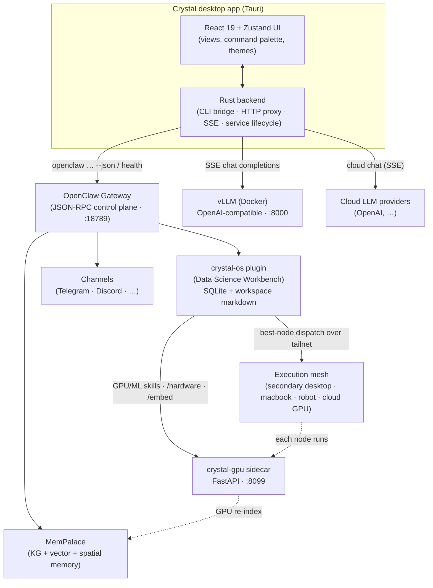

<h1 align="center">Crystal</h1>

<p align="center">
  <strong>A native desktop home base for long-running AI agents — and a GPU-first data-science workbench.</strong>
</p>

<p align="center">
  Crystal is a <a href="https://v2.tauri.app/">Tauri</a> desktop app that wraps an <a href="https://github.com/openclaw/openclaw">OpenClaw</a> gateway in a polished GUI, then layers on the
  <strong>Crystal Data Science Workbench</strong>: structured tasks/projects/decisions/lessons, a 253-skill registry
  (201 of them official NVIDIA skills), a Tailscale execution mesh, a local GPU/ML sidecar, and a Fine-Tuning Studio.
</p>

<p align="center">
  
  
  
  
  
  <a href="LICENSE"></a>
</p>

---

## Table of Contents

- [What is Crystal?](#what-is-crystal)
- [Feature overview](#feature-overview)
- [Architecture](#architecture)
- [The Crystal Data Science Workbench](#the-crystal-data-science-workbench)
  - [Tasks, Projects, Decisions & Lessons](#tasks-projects-decisions--lessons)
  - [Skills Registry & NVIDIA Skills](#skills-registry--nvidia-skills)
  - [Execution targets & the Tailscale mesh](#execution-targets--the-tailscale-mesh)
  - [The crystal-gpu sidecar](#the-crystal-gpu-sidecar)
  - [Fine-Tuning Studio](#fine-tuning-studio)
- [Memory: MemPalace](#memory-mempalace)
- [Channels](#channels)
- [The desktop shell](#the-desktop-shell)
- [Prerequisites](#prerequisites)
- [Quickstart](#quickstart)
- [Configuration](#configuration)
- [Project layout](#project-layout)
- [Development](#development)
- [Troubleshooting](#troubleshooting)
- [Roadmap](#roadmap)
- [Contributing](#contributing)
- [License](#license)

---

## What is Crystal?

[OpenClaw](https://github.com/openclaw/openclaw) is a local-first personal AI agent framework: a gateway that
hosts agents, tools, channels, memory, and a JSON-RPC control plane. Crystal is the **native desktop application on
top of it** — instead of editing config files and reading terminal output, you get a single Windows app that starts
the services for you and exposes everything through a clean GUI.

Crystal is two things at once:

1. **A control surface for OpenClaw** — chat with your agent, watch sessions and activity, manage channels, models,
   hooks, skills, memory, and run diagnostics.
2. **The Crystal Data Science Workbench** — an operational + strategic layer (the internal `crystal-os` plugin) that
   gives the agent durable tasks, projects, decisions, and lessons; a unified skills registry; a Tailscale-based
   execution mesh; a GPU/ML sidecar; and a Fine-Tuning Studio.

> [!NOTE]
> **Naming.** *Crystal* is the desktop app. The data-science layer is the **Crystal Data Science Workbench**. Its
> internal plugin id is `crystal-os` — you only see that name in config keys (`plugins.entries.crystal-os`) and CLI
> verbs (`openclaw os …`). The Workbench features require an OpenClaw runtime that has the `crystal-os` plugin built
> and enabled (see [Configuration](#configuration)); without it, Crystal still runs as a full OpenClaw desktop client.

---

## Feature overview

| Area | What you get |
|------|--------------|
| **Desktop shell** | Custom frameless window, global show/hide shortcut, system tray, command palette (`Ctrl+K`), onboarding wizard, themeable UI, lazy-loaded views. |
| **Chat** | Streaming conversations against a local model (vLLM) or a cloud provider, with a live TPS readout, thinking-level control, and Markdown/code rendering. |
| **Local LLM** | Auto-managed [vLLM](https://github.com/vllm-project/vllm) container serving `nvidia/Qwen3-30B-A3B-NVFP4` on an OpenAI-compatible API (port `8000`). |
| **Data Science Workbench** | Board (tasks), Projects, Lessons, Decisions, Targets, and Studio views backed by the `crystal-os` plugin. |
| **Skills** | A unified registry of **253 callable skills** — **201 official NVIDIA skills** plus your Crystal `SKILL.md` and custom skills — browsable and invocable. |
| **Execution mesh** | Dispatch GPU/CPU work to any machine on your Tailscale tailnet (desktops, laptops, robots, cloud GPUs) with capability-based best-node routing. |
| **GPU/ML sidecar** | `crystal-gpu`, a localhost FastAPI service for hardware detection, GPU-first data science, GPU embeddings, and the Fine-Tuning Studio pipeline. |
| **Memory** | MemPalace canonical memory (temporal knowledge graph + hybrid/spatial retrieval), with standalone GPU re-index and evaluation tooling. |
| **Channels** | Telegram and Discord front and centre, plus the broader OpenClaw channel set. |
| **Ops** | Agents, Sessions, Activity, Hooks, Tools & Skills, Models, Usage/cost analytics, Doctor, Security, and a Forge build view. |

---

## Architecture

Crystal is a thin, fast desktop shell. The React frontend never talks to the network directly — the Rust backend owns
service lifecycle and brokers every call: it runs the `openclaw` CLI (newline-delimited JSON envelopes), proxies HTTP,
and streams LLM tokens over SSE. Heavy and GPU work is delegated to the `crystal-gpu` sidecar and, optionally, to other
machines on a Tailscale mesh.



**Key ports:** OpenClaw gateway `18789` · vLLM (OpenAI-compatible) `8000` · crystal-gpu sidecar `8099`.

---

## The Crystal Data Science Workbench

The Workbench is the `crystal-os` plugin: a durable **operational + strategic awareness layer** for the agent. It is
additive and opt-in — a plugin plus a sidecar, not a core rewrite — and it persists to its own SQLite database
(`~/.openclaw/crystal-os/crystal-os.sqlite3`) while linking out to MemPalace and workspace markdown.

In the desktop app these surfaces live under the **Crystal Data Science Workbench** navigation group: **Board**, **Projects**,
**Lessons**, **Decisions**, **Targets**, and **Studio**.

### Tasks, Projects, Decisions & Lessons

| Entity | What it is | Where |
|--------|-----------|-------|
| **Tasks** | First-class tasks with a full status lifecycle (`backlog → todo → in_progress → blocked → review → completed → archived`), subtasks, and a dependency DAG with **automatic blocker detection**. Every execution attempt is recorded. | **Board** |
| **Projects** | Group goals, milestones, and tasks, and own a `project_state` operating-memory snapshot (current milestone, blockers, next actions, open questions). On creation they scaffold human-readable docs under `~/.openclaw/workspace/projects/<slug>/`. | **Projects** |
| **Decisions** | Architecture/strategy choices captured with context, options considered, the chosen option, and rationale — searchable before you make a related call. | **Decisions** |
| **Lessons** | Recorded `problem → solution → outcome` with a confidence score, linked to the source run — consult before risky work, record after notable outcomes. | **Lessons** |

These let the agent (and you) keep work coherent across turns, sessions, and machines instead of relying on free-text
chat history.

### Skills Registry & NVIDIA Skills

The Skills Registry (in the **Tools & Skills** view) is a unified, searchable catalog of *callable* skills reconciled
from three sources:

- **`nvidia`** — the **201 official NVIDIA agent skills** from [github.com/nvidia/skills](https://github.com/nvidia/skills),
  installed under `~/.openclaw/workspace/skills/<name>/SKILL.md`.
- **`crystal`** — your existing OpenClaw `SKILL.md` skills (read-only).
- **`custom`** — skills you register yourself.

After import the registry holds **253 callable skills**. Every skill is mapped to one of seven categories, and to the
GPU libraries it exercises (cuDF, NeMo, TensorRT-LLM, cuOpt, …):

| Category | Count | Examples |
|----------|------:|----------|
| Training | 72 | NeMo RL / AutoModel / Megatron-Bridge, AutoML/TAO, ASR fine-tune |
| Inference | 37 | Dynamo deploy/serve/router, TensorRT-LLM, NIM, RAG, Riva |
| Automation | 34 | install / configure / run-on-slurm / monitor lifecycle ops |
| Development | 23 | CUDA-tile (TileGym) kernels, recipe/plugin dev, DeepStream |
| Data Science | 20 | cuDF, cuPyNumeric, cuOpt, DICOM, dataset convert/load |
| Evaluation | 9 | eval, gap analysis, RCA, dataset validation, readiness checks |
| Research | 6 | PhysicsNeMo, Earth-2, CUDA-Q, neural reconstruction |

Agents use two tools — `skill_search` (discover by intent) and `skill_invoke` (run end-to-end, with input/output
validation). GPU/ML skills dispatch through the execution engine to the `crystal-gpu` sidecar, falling back to CPU when
no accelerated target is healthy. Humans browse and invoke the same catalog from the UI.

> The skills are *registered* by default, but agents can only *call* them when the `crystal-os` plugin is enabled, its
> tools (`skill_search`, `skill_invoke`) are allowlisted, and `skills.limits` are raised above 201. See
> [Configuration](#configuration).

### Execution targets & the Tailscale mesh

All cross-machine work goes through a single `ExecutionTarget` abstraction (`dispatch / monitor / retrieve / cancel`,
plus `healthCheck`) so no machine is ever hardcoded. Remote nodes are reached **privately over a
[Tailscale](https://tailscale.com) tailnet** — by MagicDNS hostname or `100.x` CGNAT address, never a LAN or public IP.

| Target kind | Transport | Typical use |
|-------------|-----------|-------------|
| `local_desktop` | local process | CPU fallback, always available |
| `secondary_desktop` | SSH / Tailscale SSH | another desktop or GPU rig |
| `macbook` | SSH / Tailscale SSH | laptop node |
| `robot` | SSH / Tailscale SSH | edge / robot node |
| `cloud_gpu` | HTTP job API over tailnet | rented cloud GPU |
| `future_dgx` | HTTP job API over tailnet | reserved DGX-class box |

Capability tracking pulls each node's `crystal-gpu /hardware` report (GPU model/VRAM, CUDA, RAM, libraries) and
**best-node dispatch** picks the healthiest, least-loaded target that fits the job's required tags and VRAM — with
**local CPU fallback** so a routed job is never stranded. The whole system **degrades gracefully when the `tailscale`
CLI is absent** (reachability becomes `unknown`; it falls back to direct SSH over the same mesh hostname).

```bash
# Register a GPU rig reachable as MagicDNS "gpu-rig":
openclaw os targets add --kind secondary_desktop --label "GPU rig" \
  --tailscale-host gpu-rig --tags tag:gpu,tag:trusted --json

# Preview where a 24 GB-VRAM CUDA job would go (dry run):
openclaw os targets dispatch --capabilities gpu,cuda --vram 24 --json
```

### The crystal-gpu sidecar

`crystal-gpu` is a self-contained FastAPI service (default `http://127.0.0.1:8099`) that is **independent of the
Workbench DB and MemPalace** and **runs even with no GPU libraries installed** (graceful CPU degradation). It owns:

- **Hardware detection** (`GET /hardware`) — GPU/VRAM/CUDA/RAM/CPU/storage + installed libs + recommendations.
- **GPU-first data science** (`POST /datascience/run`) — inspects a dataset, picks the optimal backend (RAPIDS
  cuDF/cuML/Dask-cuDF vs pandas/sklearn), prefers GPU when beneficial, falls back to CPU, and benchmarks every run.
- **GPU embeddings** (`POST /embed`) — BGE-class embeddings on GPU when available; returns `model` + `dimension` so
  callers can detect index drift. This is what the MemPalace re-index consumes.
- **NVIDIA skill descriptors** (`GET /skills`) — declarative specs the Workbench registry imports.
- **Fine-Tuning Studio** (`/studio/*`) — see below.

> [!IMPORTANT]
> **Windows note.** RAPIDS and NeMo are friction-prone on native Windows. For GPU data science and training, prefer
> **WSL2** or the **Docker** image — the hardware detector reports this and the engine falls back to pandas safely.

### Fine-Tuning Studio

The Studio (the **Studio** view + the sidecar) drives a typed dataset-to-model pipeline:

```
Import → Analysis → Cleaning → Dedup → PIIDetection → Split →
BaseModelSelection → TrainingConfig → FineTune → Eval → Deploy → Reporting
```

The **data-prep stages run for real today** (analysis, cleaning, dedup, PII detection, split, base-model selection,
training config, reporting, with a `report.json` artifact). **Training / eval / deploy run behind pluggable backends** —
`Trainer` implementations (Unsloth QLoRA, Axolotl, NeMo) and `Deployer` implementations (vLLM / NIM / OpenAI-compatible).
Real training requires the GPU sidecar with the appropriate libraries installed (and is best run on a GPU node via the
mesh). Treat end-to-end training as **gated on that runtime** rather than turnkey from a fresh install.

---

## Memory: MemPalace

MemPalace is Crystal's canonical memory store — a temporal knowledge graph plus hybrid BM25 + vector + spatial document
layers (L0–L3). The **Memory** view browses and edits it.

The Workbench ships **standalone, non-destructive upgrade tools** in `memory-tools/` (no edits to the external MemPalace
package), each degrading gracefully when MemPalace, Chroma, the sidecar, or GPU libs are absent:

- **GPU re-index** (`reindex_embeddings.py`) re-embeds drawers via the sidecar `/embed` into a new `*_v2` collection,
  leaving the live index intact and recording `embedding_model` + `dimension` for drift detection.
- **Bi-temporal KG** (`kg_bitemporal.py`) adds `created_at / valid_at / invalid_at / expired_at` additively and
  *invalidates* (never deletes) superseded facts for time-travel / as-of queries.
- **Entity resolution** (`entity_resolution.py`) merges near-duplicate entities and links new captures to existing drawers.
- **Evaluation harness** (`eval_harness.py`) scores recall@k / MRR / temporal accuracy and gates the index swap.

> [!NOTE]
> MemPalace's built-in query embedder is a fixed CPU MiniLM-L6-v2 (384-dim). A different-dimension GPU index therefore
> can't be served *through* MemPalace's own search without forking the package — the re-index + `search_v2.py` path
> makes the GPU index usable today; a true in-place embedder swap is the one item blocked upstream. See
> `memory-tools/README.md`.

---

## Channels

Crystal surfaces OpenClaw's channels in the **Channels** view. The primary, first-class channels are **Telegram** and
**Discord** (the package describes Telegram as the remote channel of choice); the broader OpenClaw channel set
(WhatsApp, Slack, Signal, iMessage, Google Chat, Email, Matrix, IRC, Linear, Nostr, …) is available where the underlying
OpenClaw build supports it.

---

## The desktop shell

- **Frameless, transparent window** (1100×750 default, custom title bar and resize handles).
- **Global toggle shortcut** to show/hide Crystal, plus a **system tray** icon.
- **Command palette** (`Ctrl+K`) to jump to any view.
- **Onboarding wizard** on first run (checks prerequisites, configures the LLM, verifies the gateway).
- **Themeable, lazy-loaded views** — each view is code-split and kept alive briefly after navigation for snappy switching.
- **Auto-managed services** — on launch the Rust backend starts the OpenClaw gateway (preferring a `gateway.cmd`
  wrapper that injects 1Password secrets via `op run`) and the vLLM Docker container, and stops them on exit.

---

## Prerequisites

| Requirement | Details |
|-------------|---------|
| **OS** | Windows 10/11 (the build targets MSI/NSIS installers). |
| **Node.js** | v18+ for the app toolchain. The OpenClaw gateway runtime itself prefers Node 22.16+ / 24. |
| **pnpm** | `pnpm@10.30.3` (declared in `package.json`). |
| **Rust** | Latest stable toolchain (for the Tauri backend). |
| **OpenClaw** | An OpenClaw install reachable on the `openclaw` CLI. Workbench features need a build with the `crystal-os` plugin. |
| **Docker** *(local LLM)* | Docker Desktop + [NVIDIA Container Toolkit](https://docs.nvidia.com/datacenter/cloud-native/container-toolkit/latest/install-guide.html) to run vLLM. |
| **NVIDIA GPU** *(local LLM)* | An RTX-class GPU with enough VRAM for the NVFP4 30B MoE model (≈17 GB+ for the model; 24 GB+ recommended). |
| **Python 3** *(crystal-gpu)* | For the GPU/ML sidecar (a virtualenv; optional GPU libs for RAPIDS/embeddings). |

> **Cloud-only mode:** no NVIDIA GPU? Skip vLLM/Docker and point Crystal at a cloud LLM provider via API keys.

---

## Quickstart

All app commands run from the `mogwai/` directory.

### 1. Install dependencies

```bash
pnpm install
```

### 2. Run in development

```bash
pnpm tauri dev
```

This launches the Vite dev server and the Tauri shell. On first launch Crystal attempts to start the OpenClaw gateway
(port `18789`) and the vLLM container, and the onboarding wizard walks you through anything missing.

### 3. Build a release installer

```bash
pnpm tauri build
```

Produces MSI and NSIS installers for Windows.

### 4. (Optional) Start the local LLM manually

```bash
# from mogwai/ — set a HuggingFace token for the gated model first
echo "HF_TOKEN=hf_your_token_here" > .env
docker compose up -d            # serves nvidia/Qwen3-30B-A3B-NVFP4 on :8000
```

### 5. (Optional) Start the crystal-gpu sidecar

```bash
cd ../crystal-gpu
python -m venv .venv && .\.venv\Scripts\Activate.ps1
pip install fastapi "uvicorn[standard]" "pydantic>=2" PyYAML psutil pandas pyarrow numpy scikit-learn
python -m app.main              # http://127.0.0.1:8099  (docs at /docs)
```

### Useful scripts

| Command | Purpose |
|---------|---------|
| `pnpm dev` | Vite dev server only (no Tauri shell). |
| `pnpm build` | Type-check (`tsc`) + production frontend build. |
| `pnpm tauri dev` | Full desktop app with hot reload. |
| `pnpm tauri build` | Build the desktop installer. |
| `pnpm test` | Run the Vitest suite once. |
| `pnpm test:watch` | Run Vitest in watch mode. |

---

## Configuration

Crystal reads the standard OpenClaw config at `~/.openclaw/openclaw.json`. The bits that matter most for Crystal:

### Local LLM provider (vLLM)

The vLLM container exposes an OpenAI-compatible API at `http://127.0.0.1:8000/v1`; Crystal auto-detects it and can chat
against it directly. Cloud providers are configured with their API keys (managed in the **Tools & Skills → Keys** UI,
which writes to OpenClaw's auth profiles).

### Enabling the Crystal Data Science Workbench (`crystal-os`)

The Workbench is opt-in. For the agent to use it, the active config needs:

```jsonc
{
  "plugins": {
    "entries": {
      "crystal-os": {
        "enabled": true,
        "config": {
          // optional: override the GPU sidecar base URL
          "sidecarBaseUrl": "http://127.0.0.1:8099"
        }
      }
    }
  },
  "tools": {
    // crystal-os tools are declared "optional", so allowlist the ones you want
    "alsoAllow": ["skill_search", "skill_invoke"]
  },
  "skills": {
    "limits": {
      "maxSkillsLoadedPerSource": 256,  // default 200 caps the 201 NVIDIA skills
      "maxSkillsInPrompt": 256
    }
  }
}
```

The plugin must also be **built** (its `dist/` present) in the OpenClaw runtime serving the CLI, and config changes that
affect loaded plugins/limits require a **gateway restart**.

### crystal-gpu sidecar (env vars)

| Variable | Default | Meaning |
|----------|---------|---------|
| `CRYSTAL_GPU_HOST` / `CRYSTAL_GPU_PORT` | `127.0.0.1` / `8099` | Bind host/port (localhost-only by default). |
| `CRYSTAL_GPU_EMBED_MODEL` | `BAAI/bge-small-en-v1.5` | Default embedding model. |
| `CRYSTAL_GPU_EMBED_DEVICE` | `auto` | `auto` \| `cuda` \| `cpu`. |
| `CRYSTAL_GPU_PREFER_GPU` | `true` | GPU-first backend selection. |
| `CRYSTAL_GPU_STUDIO_WORKDIR` | `~/.crystal-gpu/studio` | Where Studio reports are written. |

### Execution mesh (env vars)

| Variable | Default | Meaning |
|----------|---------|---------|
| `CRYSTAL_OS_NODE_SIDECAR_PORT` | `8099` | Sidecar port on a mesh node (for `/hardware`/`/health`). |
| `CRYSTAL_OS_REMOTE_TIMEOUT_MS` | `30000` | Timeout for SSH / HTTP remote ops. |
| `CRYSTAL_OS_SIDECAR_BASE` | `http://127.0.0.1:8099` | Local sidecar base (for `local_desktop` caps). |

No machine IPs are configured anywhere — nodes are addressed by Tailscale host.

---

## Project layout

This README documents the **Crystal desktop app** in `mogwai/`. The full system spans sibling directories in the parent
workspace:

```
mogwai/                      # Crystal desktop app (this repo)
├── src/                     # React 19 + TypeScript frontend
│   ├── components/
│   │   ├── shell/           # TitleBar, Navigation, CommandPalette, Onboarding, Toast
│   │   └── views/           # Feature views (Home, Chat, Board, Projects, Studio, Targets, …)
│   ├── lib/
│   │   ├── openclaw.ts      # OpenClaw client (gateway, LLM, memory, channels, crystal-os)
│   │   └── memory-palace.ts # MemPalace integration
│   └── stores/              # Zustand stores (appStore, dataStore, osStore, …)
├── src-tauri/               # Rust backend
│   ├── src/lib.rs           # Tauri commands, service lifecycle, system tray
│   ├── tauri.conf.json      # Tauri config (window, bundle, CSP)
│   └── Cargo.toml
├── docker-compose.yml       # vLLM (Qwen3-30B-A3B-NVFP4, NVFP4 + Marlin + FP8 KV)
└── package.json

../crystal-gpu/              # Python GPU/ML sidecar (FastAPI, :8099)
../crystal-os-docs/          # Durable Workbench docs (CAPABILITIES, NVIDIA_SKILLS, TAILSCALE_MESH)
../memory-tools/             # Standalone MemPalace upgrade/eval tooling
```

> The `crystal-os` plugin itself lives in the OpenClaw runtime's `extensions/crystal-os/` (the OpenClaw fork), not in
> this repo — Crystal calls it via `openclaw os … --json`.

---

## Development

```bash
pnpm install        # install deps
pnpm tauri dev      # run the desktop app with hot reload
pnpm test           # run unit tests (Vitest)
pnpm build          # type-check + build the frontend bundle
```

- **Frontend:** React 19, TypeScript, Tailwind CSS 4, Zustand 5, Vite 7, Lucide icons, `react-markdown` +
  `remark-gfm` + `rehype-highlight`.
- **Backend:** Rust (Tokio, Reqwest, Serde) with `tauri-plugin-global-shortcut`, `-opener`, and `-single-instance`.
  The backend exposes ~20 Tauri commands (shell exec + streaming, file IO, system/GPU stats, the HTTP proxy, direct
  chat streaming, and gateway/vLLM lifecycle).
- The frontend talks **only** to the Rust backend; the backend brokers all external calls.

---

## Troubleshooting

| Symptom | Likely cause / fix |
|---------|--------------------|
| Gateway never connects | The OpenClaw gateway isn't healthy on `18789`. Crystal tries to start it (via `gateway.cmd` or `openclaw gateway start`); run `openclaw doctor` and check that the CLI is on `PATH`. |
| Chat says no local model | vLLM isn't up on `8000`. Start Docker Desktop, then `docker compose up -d`; first run downloads ~15 GB and CUDA-graph compilation can take several minutes. Or switch to a cloud provider. |
| "Crystal Data Science Workbench is not enabled" | The `crystal-os` plugin isn't loaded by the `openclaw` binary serving the CLI — it must be built and enabled (see [Configuration](#configuration)), then restart the gateway. |
| Only 200 of 201 NVIDIA skills load | `skills.limits.maxSkillsLoadedPerSource` defaults to 200 — raise it to 256. |
| GPU data science falls back to CPU on Windows | Expected — RAPIDS/NeMo aren't supported on native Windows. Use WSL2 or the Docker image. |
| Mesh node won't win VRAM-constrained routing | Its sidecar `/hardware` is unreachable. Run `openclaw os targets caps` to refresh; the node is marked `unreachable` until it recovers. |

---

## Roadmap

These are explicitly aspirational — tracked here rather than implied as shipped:

- **Real training/eval/deploy** in Fine-Tuning Studio across all backends (the data-prep pipeline is real today;
  training runs behind pluggable Unsloth/Axolotl/NeMo trainers).
- **Tag-based ACL enforcement** in mesh dispatch (tags are stored now; Tailscale ACLs remain the real boundary).
- **Real resource reservation** for the mesh scheduler instead of coarse in-flight run counts.
- **In-place GPU embedder swap** for MemPalace (currently served via the `*_v2` re-index + `search_v2.py` path).
- **macOS / Linux desktop builds** (current installers target Windows).

---

## Contributing

Contributions are welcome — please open an issue to discuss substantial changes first.

```bash
pnpm install
pnpm tauri dev      # iterate
pnpm test           # keep the suite green
```

## License

[MIT](LICENSE) © 2026 Jarrod (Crystal / Mogwai).

<p align="center"><sub>Built with Tauri, React, Rust, and OpenClaw. Local-first. GPU-accelerated. Yours to own.</sub></p>
